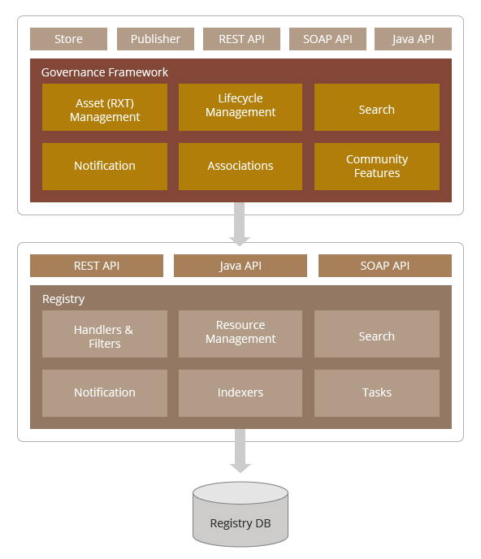
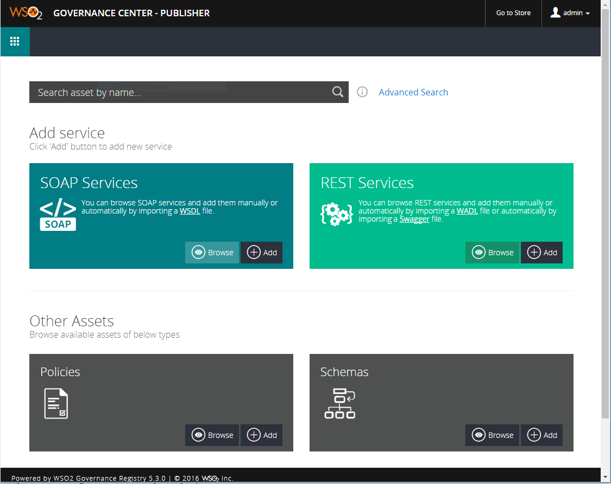
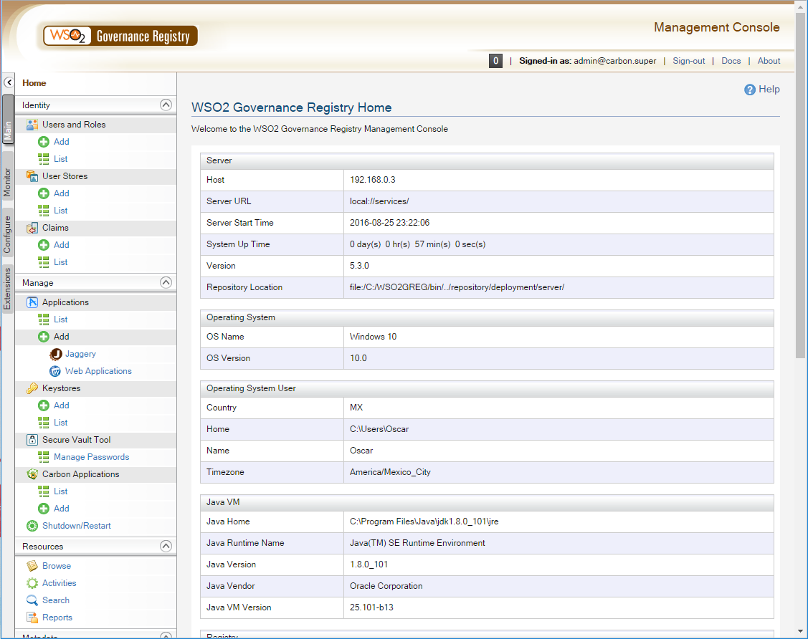

Governance Registry
---
WSO2 Governance Registry provee soporte para la gobernabilidad de activos empresariales, gobernabilidad en el proceso de desarrollo, diseño y tiempo de ejecución, administracion del ciclo de vida y colaboración en equipo.

##### Contenido: {#contenido}
1. [Arquitectura](#arquitectura)  
2. [Repositorio](#repositorio)  
3. [Registro](#registro)  
4. [Consola de administracion](#consola)
4. [Ciclo de Vida](#cicloDeVida)  
5. [Estandares](#estandares)  

 
####  Arquitectura {#arquitectura}
---

En las organizaciones, las personas estan involucradas con el gobierno en varias formas. La arquitectura de WSO2 Governance Registry es descrita en las siguientes estructuras:

+ Grupos de usuarios

| Grupo de usuarios | Descripcion | Portal |
| :--- | :--- | :---: |
| consumidor | Es un usuario que busca activos (como servicios) y artefactos relacionados para consumirlos y  reutilizarlos | Governance, Store  |
| gobernador | Es un usuario que se encarga de poblar el Registro con activos, y usa el Registro para gobernarlos a ellos (documentos, ciclos de vida, dependencias entre activos) | Governance, Publisher |
| administrador | Es un usuario que es responsable de administrar el sistema entero (crea nuevos tipos de activos, ciclos de vida personalizados, remueve o agrega nuevos grupos y roles de ususarios)| Management, Console |
| agentes | Un agente es otro sistema que interactua con WSO2-GR | SOAP/REST/Java APIs |

+ Arquitectura de alto nivel esta compuesta por los componentes principales:

  1. Governance Framework 
  2. Registry.

####  Repositorio {#repositorio}
---

El **repositorio** es un lugar centralizado para los activos empresariales, tales como XSDs, WSDLs, Servicios SOAP y REST, etc.. 

EL repositorio funciona como una herramienta que mantiene la informacion de como los servicios son usados, como interactuan, quienes usan los servicios y por que son usados.

[Repositorio (Store)](https://localhost:9443/store "store")

####  Registro {#registro}
---

El **registro** es una herramienta que provee de las siguientes caracteristicas:

+ Publicar servicios.
+ Descubrir servicios (mediante web y api)
+ Control de acceso (mediante roles y con trazabilidad)
+ Establecer dependencias y asociaciones (entre otros activos y/o usuarios)
+ Permisos para accesar a los servicios

[Registro (Publisher)](https://localhost:9443/publisher "store")

####  Consola de administracion {#consola}
---

La consola de administración permite configurar, monitorear, optimizar y mantener WSO2-GR.

[Consola Administracion](https://localhost:9443/carbon "console")

####  Ciclo de Vida {#cicloDeVida}
---

Podemos definir un ciclo de vida personalizado para los servicios, en donde cada estado contiene un checklist para los usuarios y roles involucrados en dicho ciclo de vida.

Incluye notificaciones mediante los siguientes medios: 

+ Email
+ REST
+ SOAP
+ User Profile (via email a un conjunto de usuarios)

Puntos de extension:

+ Handlers
+ Filters
+ Aspects

####  Estandares {#estandares}
---
+ WebDAV       - (integrar filesystem)
+ UDDI         - (descubrir e integrar servicios)
+ JAXR         - (conectar con registros)
+ JRC          - (conectar con repositorios)
+ WS-Discovery - (descubrimiento dinamico servicios)
+ LDAP         - (integracion con directorio de usuarios)
+ SCXML        - (estándar definir ciclos de vida)
+ WS-I         - (interoperabilidad entre web services)
+ WS-HumanTask - (interacciones humanas)

